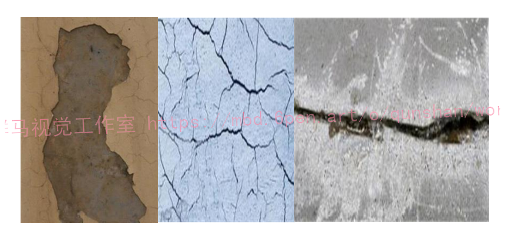
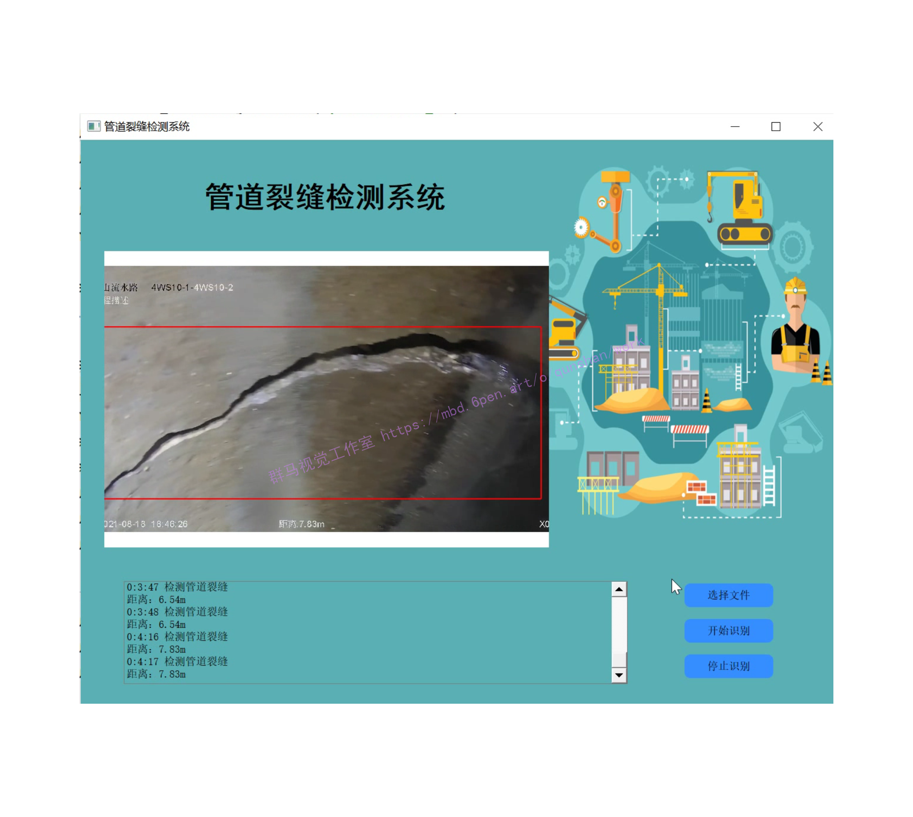
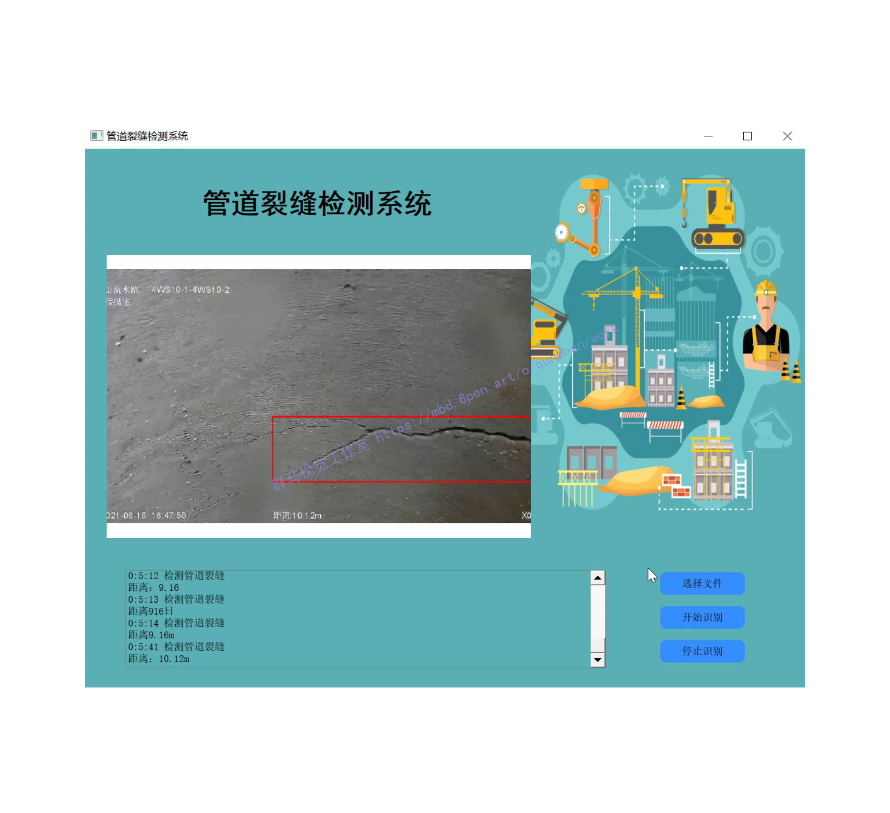
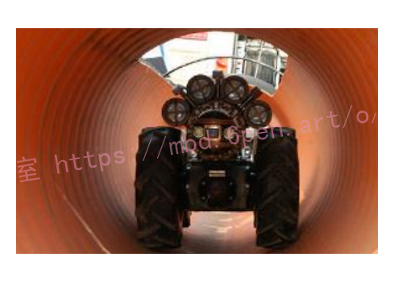
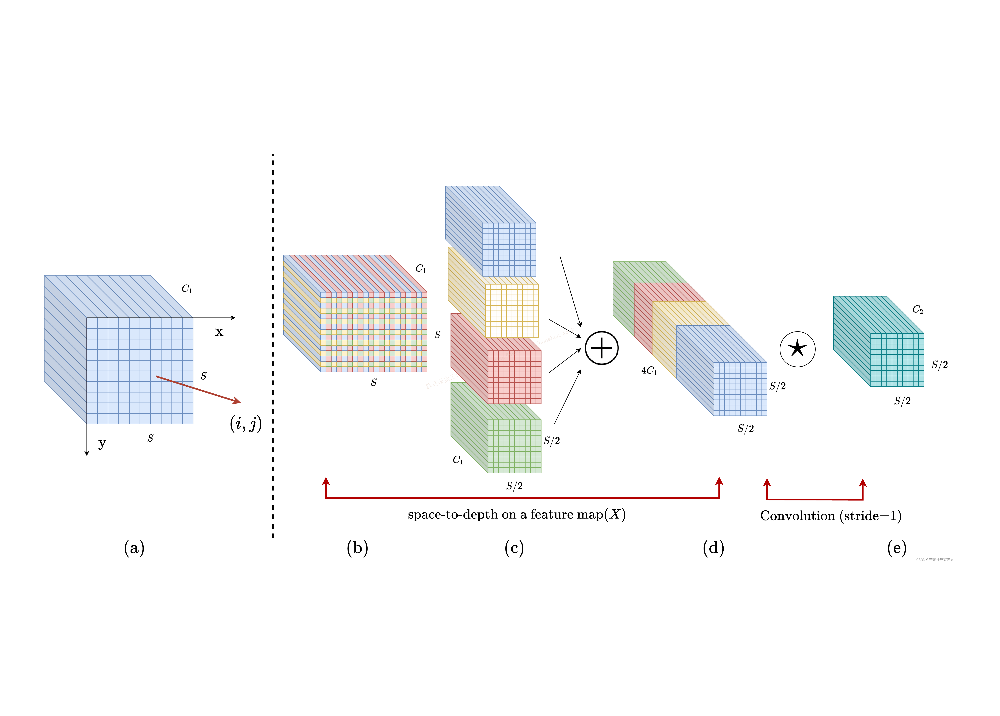
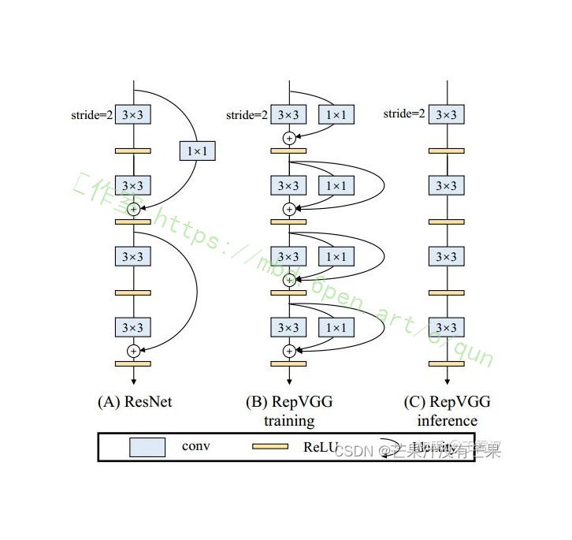
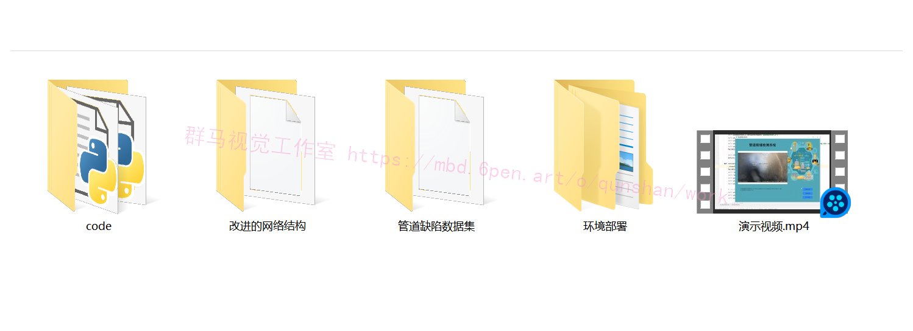

# 1.研究背景
随着现代城市的发展，城市规模不断扩大，居民越来越多，早期深埋于城市地下的排水管道己不堪重负，越来越引起人们的广泛关注。目前在工程应用领域，排水管道缺陷主要靠人工的肉眼识别，费时费力，主观误差大，因此开展排水管道缺陷智能识别研究具有重要的现实意义。管道缺陷具有类别多，差异不明显等特性，导致图像分类识别及分割出精准的缺陷区域变得十分困难，而目前缺陷的智能检测识别技术还处于起步阶段。



# 2.图片演示




# 3.视频演示
[基于改进YOLOv7和CRNN的管道裂缝检测系统（源码＆教程）_哔哩哔哩_bilibili](https://www.bilibili.com/video/BV1Vg411b7Ut/?vd_source=bc9aec86d164b67a7004b996143742dc)

# 4.硬件设备
此方法是将管道机器人放入排水管道内，在地球磁场驱动下自由爬行，稳定性高灵活性强，地面的工作人员可以远程控制机器人上的摄像头，任意弯曲和压缩，质量比较轻，摄像头可以拍出清晰标准化的图像信息，直接连接在显示器上供检测人员查看。所以此项技术是将机器人所具有的移动技术、机械自动控制技术、智能监测跟踪技术、数据自动化处理技术和系统评估技术相结合的新型技术，具有多种功能。此设备为我国引进德国的设备，相关核心技术还没有掌握，所以目前检测成本比较高。


# 5.国内外研究现状
当前排水管道检测方法众多，比较传统的检测方法有，①目视法，即通过观察管井水位，判断排水管道是否存在堵塞;通过观察比较上下游管井内的水质状况来判断管道段内是否存在破裂、内壁脱落或坍塌。②反射镜检查:通过光线反射原理，观察管井附近管道是否存在堵塞、管壁腐蚀、障碍物等缺陷。③潜水员进入管道进行检查:在紧急情况或缺乏检测设备的地区再或管道环境良好的人可接近的大口径管道下采用,但必须采取一定的安全预防措施，保证工作人员的健康与安全。④泥浆计量桶检测:主要是检测下游缓流处的泥浆沉积厚度，防止泥浆过厚影响正常管径大小导致的管道排水量减低。传统的排水管道检测方法具有简单方便直观的优点，在先进设备缺乏，管道质量良好的条件情况下可发挥辅助作用，但存在着一定的局限性，不能满足现代排水管道检测维修的要求。目前国内外管道检测系统主要有管道扫描与评价检测系统(SSET)、管道内窥镜声纳检测、多重传感检测系统、潜望镜检测、管道闭路电视检测系统（CCTV)、探地雷达以及红外温度记录与分析等。

# 6.改进YOLOv7
#### SPD-Conv
卷积神经网络 (CNN) 在许多计算机视觉任务（例如图像分类和对象检测）中取得了巨大成功。然而，它们的性能在图像分辨率低或物体很小的更艰巨的任务中迅速下降。[参考该博客指出，这源于现有 CNN 架构中存在缺陷但常见的设计](https://mbd.pub/o/bread/Y52ZmZ9r)，即使用跨步卷积和/或池化层，这会导致细粒度信息的丢失和对不太有效的特征表示的学习. 为此，我们提出了一个名为SPD-Conv的新 CNN 构建块来代替每个跨步卷积层和每个池化层（因此完全消除了它们）。SPD-Conv 由空间到深度(SPD) 层后跟非跨步卷积 (Conv) 层，可以应用于大多数（如果不是全部）CNN 架构。我们在两个最具代表性的计算机视觉任务下解释了这种新设计：对象检测和图像分类。然后，我们通过将 SPD-Conv 应用于 YOLOv7 和 ResNet 来创建新的 CNN 架构，并通过经验证明我们的方法明显优于最先进的深度学习模型，尤其是在具有低分辨率图像和小物体的更艰巨任务上。



#### RepVGG模块
[该博客提出的RepVGG模块](https://afdian.net/item?plan_id=bea0d0b2836411ed898652540025c377)如下:

（1）没有任何分支结构。即通常所说的plain或feed-forward架构。

（2）仅使用3x3卷积。

（3）仅使用ReLU作为激活函数。

下面用一句话介绍RepVGG模型的基本架构：将20多层3x3卷积堆起来，分成5个stage，每个stage的第一层是stride=2的降采样，每个卷积层用ReLU作为激活函数。

再用一句话介绍RepVGG模型的详细结构：RepVGG-A的5个stage分别有[1, 2, 4, 14, 1]层，RepVGG-B的5个stage分别有[1, 4, 6, 16, 1]层，宽度是[64, 128, 256, 512]的若干倍。这里的倍数是随意指定的诸如1.5,2.5这样的“工整”的数字，没有经过细调。

再用一句话介绍训练设定：ImageNet上120 epochs，不用trick，甚至直接用PyTorch官方示例的训练代码就能训出来！

为什么要设计这种极简模型，这么简单的纯手工设计模型又是如何在该数据集上达到SOTA水平的呢？


除了我们相信简单就是美以外，VGG式极简模型至少还有五大现实的优势。

3x3卷积非常快。在GPU上，3x3卷积的计算密度（理论运算量除以所用时间）可达1x1和5x5卷积的四倍。

单路架构非常快，因为并行度高。同样的计算量，“大而整”的运算效率远超“小而碎”的运算。

单路架构省内存。例如，ResNet的shortcut虽然不占计算量，却增加了一倍的显存占用。

单路架构灵活性更好，容易改变各层的宽度（如剪枝）。

RepVGG主体部分只有一种算子：3x3卷积接ReLU。在设计专用芯片时，给定芯片尺寸或造价，我们可以集成海量的3x3卷积-ReLU计算单元来达到很高的效率。别忘了，单路架构省内存的特性也可以帮我们少做存储单元。

结构重参数化让VGG再次伟大
相比于各种多分支架构（如ResNet，Inception，DenseNet，各种NAS架构），近年来VGG式模型鲜有关注，主要自然是因为性能差。例如，有研究[1]认为，ResNet性能好的一种解释是ResNet的分支结构（shortcut）产生了一个大量子模型的隐式ensemble（因为每遇到一次分支，总的路径就变成两倍），单路架构显然不具备这种特点。

既然多分支架构是对训练有益的，而我们想要部署的模型是单路架构，我们提出解耦训练时和推理时架构。我们通常使用模型的方式是：

（1）训练一个模型

（2）部署这个模型

但在这里，文中提出一个新的做法：

训练一个多分支模型
将多分支模型等价转换为单路模型
部署单路模型
这样就可以同时利用多分支模型训练时的优势（性能高）和单路模型推理时的好处（速度快、省内存）。这里的关键显然在于这种多分支模型的构造形式和转换的方式。

论文的实现方式是在训练时，为每一个3x3卷积层添加平行的1x1卷积分支和恒等映射分支，构成一个RepVGG Block。这种设计是借鉴ResNet的做法，区别在于ResNet是每隔两层或三层加一分支，而我们是每层都加。
训练完成后，作者对模型做等价转换，得到部署模型。根据卷积的线性（具体来说是可加性），设三个3x3卷积核分别是W1，W2，W3，有 conv(x, W1) + conv(x, W2) + conv(x, W3) = conv(x, W1+W2+W3)）。怎样利用这一原理将一个RepVGG Block转换为一个卷积呢？
其实非常简单，因为RepVGG Block中的1x1卷积是相当于一个特殊（卷积核中有很多0）的3x3卷积，而恒等映射是一个特殊（以单位矩阵为卷积核）的1x1卷积，因此也是一个特殊的3x3卷积！我们只需要：1. 把identity转换为1x1卷积，只要构造出一个以单位矩阵为卷积核的1x1卷积即可；2. 把1x1卷积等价转换为3x3卷积，只要用0填充即可。…具体可以看作者的文章
从这一转换过程中，我们看到了“结构重参数化”的实质：训练时的结构对应一组参数，推理时我们想要的结构对应另一组参数；只要能把前者的参数等价转换为后者，就可以将前者的结构等价转换为后者。

# 7.代码实现
```

import json
import math
import platform
import warnings
from collections import OrderedDict, namedtuple
from copy import copy
from pathlib import Path

import cv2
import numpy as np
import pandas as pd
import requests
import torch
import torch.nn as nn
import yaml
from PIL import Image
from torch.cuda import amp

from utils.datasets import exif_transpose, letterbox
from utils.general import (LOGGER, check_requirements, check_suffix, check_version, colorstr, increment_path,
                           make_divisible, non_max_suppression, scale_coords, xywh2xyxy, xyxy2xywh)
from utils.plots import Annotator, colors, save_one_box
from utils.torch_utils import copy_attr, time_sync


def autopad(k, p=None):  # kernel, padding
    # Pad to 'same'
    if p is None:
        p = k // 2 if isinstance(k, int) else [x // 2 for x in k]  # auto-pad
    return p


class Conv(nn.Module):
    # Standard convolution
    def __init__(self, c1, c2, k=1, s=1, p=None, g=1, act=True):  # ch_in, ch_out, kernel, stride, padding, groups
        super().__init__()
        self.conv = nn.Conv2d(c1, c2, k, s, autopad(k, p), groups=g, bias=False)
        self.bn = nn.BatchNorm2d(c2)
        self.act = nn.SiLU() if act is True else (act if isinstance(act, nn.Module) else nn.Identity())

    def forward(self, x):
        return self.act(self.bn(self.conv(x)))

    def forward_fuse(self, x):
        return self.act(self.conv(x))


class DWConv(Conv):
    # Depth-wise convolution class
    def __init__(self, c1, c2, k=1, s=1, act=True):  # ch_in, ch_out, kernel, stride, padding, groups
        super().__init__(c1, c2, k, s, g=math.gcd(c1, c2), act=act)


class TransformerLayer(nn.Module):
    # Transformer layer https://arxiv.org/abs/2010.11929 (LayerNorm layers removed for better performance)
    def __init__(self, c, num_heads):
        super().__init__()
        self.q = nn.Linear(c, c, bias=False)
        self.k = nn.Linear(c, c, bias=False)
        self.v = nn.Linear(c, c, bias=False)
        self.ma = nn.MultiheadAttention(embed_dim=c, num_heads=num_heads)
        self.fc1 = nn.Linear(c, c, bias=False)
        self.fc2 = nn.Linear(c, c, bias=False)

    def forward(self, x):
        x = self.ma(self.q(x), self.k(x), self.v(x))[0] + x
        x = self.fc2(self.fc1(x)) + x
        return x


class TransformerBlock(nn.Module):
    # Vision Transformer https://arxiv.org/abs/2010.11929
    def __init__(self, c1, c2, num_heads, num_layers):
        super().__init__()
        self.conv = None
        if c1 != c2:
            self.conv = Conv(c1, c2)
        self.linear = nn.Linear(c2, c2)  # learnable position embedding
        self.tr = nn.Sequential(*(TransformerLayer(c2, num_heads) for _ in range(num_layers)))
        self.c2 = c2

    def forward(self, x):
        if self.conv is not None:
            x = self.conv(x)
        b, _, w, h = x.shape
        p = x.flatten(2).permute(2, 0, 1)
        return self.tr(p + self.linear(p)).permute(1, 2, 0).reshape(b, self.c2, w, h)


class Bottleneck(nn.Module):
    # Standard bottleneck
    def __init__(self, c1, c2, shortcut=True, g=1, e=0.5):  # ch_in, ch_out, shortcut, groups, expansion
        super().__init__()
        c_ = int(c2 * e)  # hidden channels
        self.cv1 = Conv(c1, c_, 1, 1)
        self.cv2 = Conv(c_, c2, 3, 1, g=g)
        self.add = shortcut and c1 == c2

    def forward(self, x):
        return x + self.cv2(self.cv1(x)) if self.add else self.cv2(self.cv1(x))


class BottleneckCSP(nn.Module):
    # CSP Bottleneck https://github.com/WongKinYiu/CrossStagePartialNetworks
    def __init__(self, c1, c2, n=1, shortcut=True, g=1, e=0.5):  # ch_in, ch_out, number, shortcut, groups, expansion
        super().__init__()
        c_ = int(c2 * e)  # hidden channels
        self.cv1 = Conv(c1, c_, 1, 1)
        self.cv2 = nn.Conv2d(c1, c_, 1, 1, bias=False)
        self.cv3 = nn.Conv2d(c_, c_, 1, 1, bias=False)
        self.cv4 = Conv(2 * c_, c2, 1, 1)
        self.bn = nn.BatchNorm2d(2 * c_)  # applied to cat(cv2, cv3)
        self.act = nn.SiLU()
        self.m = nn.Sequential(*(Bottleneck(c_, c_, shortcut, g, e=1.0) for _ in range(n)))

    def forward(self, x):
        y1 = self.cv3(self.m(self.cv1(x)))
        y2 = self.cv2(x)
        return self.cv4(self.act(self.bn(torch.cat((y1, y2), dim=1))))


class C3(nn.Module):
    # CSP Bottleneck with 3 convolutions
    def __init__(self, c1, c2, n=1, shortcut=True, g=1, e=0.5):  # ch_in, ch_out, number, shortcut, groups, expansion
        super().__init__()
        c_ = int(c2 * e)  # hidden channels
        self.cv1 = Conv(c1, c_, 1, 1)
        self.cv2 = Conv(c1, c_, 1, 1)
        self.cv3 = Conv(2 * c_, c2, 1)  # act=FReLU(c2)
        self.m = nn.Sequential(*(Bottleneck(c_, c_, shortcut, g, e=1.0) for _ in range(n)))
        # self.m = nn.Sequential(*[CrossConv(c_, c_, 3, 1, g, 1.0, shortcut) for _ in range(n)])

    def forward(self, x):
        return self.cv3(torch.cat((self.m(self.cv1(x)), self.cv2(x)), dim=1))


class C3TR(C3):
    # C3 module with TransformerBlock()
    def __init__(self, c1, c2, n=1, shortcut=True, g=1, e=0.5):
        super().__init__(c1, c2, n, shortcut, g, e)
        c_ = int(c2 * e)
        self.m = TransformerBlock(c_, c_, 4, n)


class C3SPP(C3):
    # C3 module with SPP()
    def __init__(self, c1, c2, k=(5, 9, 13), n=1, shortcut=True, g=1, e=0.5):
        super().__init__(c1, c2, n, shortcut, g, e)
        c_ = int(c2 * e)
        self.m = SPP(c_, c_, k)


class C3Ghost(C3):
    # C3 module with GhostBottleneck()
    def __init__(self, c1, c2, n=1, shortcut=True, g=1, e=0.5):
        super().__init__(c1, c2, n, shortcut, g, e)
        c_ = int(c2 * e)  # hidden channels
        self.m = nn.Sequential(*(GhostBottleneck(c_, c_) for _ in range(n)))


class SPP(nn.Module):
    # Spatial Pyramid Pooling (SPP) layer https://arxiv.org/abs/1406.4729
    def __init__(self, c1, c2, k=(5, 9, 13)):
        super().__init__()
        c_ = c1 // 2  # hidden channels
        self.cv1 = Conv(c1, c_, 1, 1)
        self.cv2 = Conv(c_ * (len(k) + 1), c2, 1, 1)
        self.m = nn.ModuleList([nn.MaxPool2d(kernel_size=x, stride=1, padding=x // 2) for x in k])

    def forward(self, x):
        x = self.cv1(x)
        with warnings.catch_warnings():
            warnings.simplefilter('ignore')  # suppress torch 1.9.0 max_pool2d() warning
            return self.cv2(torch.cat([x] + [m(x) for m in self.m], 1))


class SPPF(nn.Module):
    # Spatial Pyramid Pooling - Fast (SPPF) layer for YOLOv5 by Glenn Jocher
    def __init__(self, c1, c2, k=5):  # equivalent to SPP(k=(5, 9, 13))
        super().__init__()
        c_ = c1 // 2  # hidden channels
        self.cv1 = Conv(c1, c_, 1, 1)
        self.cv2 = Conv(c_ * 4, c2, 1, 1)
        self.m = nn.MaxPool2d(kernel_size=k, stride=1, padding=k // 2)

    def forward(self, x):
        x = self.cv1(x)
        with warnings.catch_warnings():
            warnings.simplefilter('ignore')  # suppress torch 1.9.0 max_pool2d() warning
            y1 = self.m(x)
            y2 = self.m(y1)
            return self.cv2(torch.cat([x, y1, y2, self.m(y2)], 1))


class Focus(nn.Module):
    # Focus wh information into c-space
    def __init__(self, c1, c2, k=1, s=1, p=None, g=1, act=True):  # ch_in, ch_out, kernel, stride, padding, groups
        super().__init__()
        self.conv = Conv(c1 * 4, c2, k, s, p, g, act)
        # self.contract = Contract(gain=2)

    def forward(self, x):  # x(b,c,w,h) -> y(b,4c,w/2,h/2)
        return self.conv(torch.cat([x[..., ::2, ::2], x[..., 1::2, ::2], x[..., ::2, 1::2], x[..., 1::2, 1::2]], 1))
        # return self.conv(self.contract(x))


class GhostConv(nn.Module):
    # Ghost Convolution https://github.com/huawei-noah/ghostnet
    def __init__(self, c1, c2, k=1, s=1, g=1, act=True):  # ch_in, ch_out, kernel, stride, groups
        super().__init__()
        c_ = c2 // 2  # hidden channels
        self.cv1 = Conv(c1, c_, k, s, None, g, act)
        self.cv2 = Conv(c_, c_, 5, 1, None, c_, act)

    def forward(self, x):
        y = self.cv1(x)
        return torch.cat([y, self.cv2(y)], 1)


class GhostBottleneck(nn.Module):
    # Ghost Bottleneck https://github.com/huawei-noah/ghostnet
    def __init__(self, c1, c2, k=3, s=1):  # ch_in, ch_out, kernel, stride
        super().__init__()
        c_ = c2 // 2
        self.conv = nn.Sequential(GhostConv(c1, c_, 1, 1),  # pw
                                  DWConv(c_, c_, k, s, act=False) if s == 2 else nn.Identity(),  # dw
                                  GhostConv(c_, c2, 1, 1, act=False))  # pw-linear
        self.shortcut = nn.Sequential(DWConv(c1, c1, k, s, act=False),
                                      Conv(c1, c2, 1, 1, act=False)) if s == 2 else nn.Identity()

    def forward(self, x):
        return self.conv(x) + self.shortcut(x)


class Contract(nn.Module):
    # Contract width-height into channels, i.e. x(1,64,80,80) to x(1,256,40,40)
    def __init__(self, gain=2):
        super().__init__()
        self.gain = gain

    def forward(self, x):
        b, c, h, w = x.size()  # assert (h / s == 0) and (W / s == 0), 'Indivisible gain'
        s = self.gain
        x = x.view(b, c, h // s, s, w // s, s)  # x(1,64,40,2,40,2)
        x = x.permute(0, 3, 5, 1, 2, 4).contiguous()  # x(1,2,2,64,40,40)
        return x.view(b, c * s * s, h // s, w // s)  # x(1,256,40,40)


class Expand(nn.Module):
    # Expand channels into width-height, i.e. x(1,64,80,80) to x(1,16,160,160)
    def __init__(self, gain=2):
        super().__init__()
        self.gain = gain

    def forward(self, x):
        b, c, h, w = x.size()  # assert C / s ** 2 == 0, 'Indivisible gain'
        s = self.gain
        x = x.view(b, s, s, c // s ** 2, h, w)  # x(1,2,2,16,80,80)
        x = x.permute(0, 3, 4, 1, 5, 2).contiguous()  # x(1,16,80,2,80,2)
        return x.view(b, c // s ** 2, h * s, w * s)  # x(1,16,160,160)


class Concat(nn.Module):
    # Concatenate a list of tensors along dimension
    def __init__(self, dimension=1):
        super().__init__()
        self.d = dimension

    def forward(self, x):
        return torch.cat(x, self.d)


class DetectMultiBackend(nn.Module):
    # YOLOv5 MultiBackend class for python inference on various backends
    def __init__(self, weights='yolov5s.pt', device=None, dnn=False, data=None):
        # Usage:
        #   PyTorch:      weights = *.pt
        #   TorchScript:            *.torchscript
        #   CoreML:                 *.mlmodel
        #   OpenVINO:               *.xml
        #   TensorFlow:             *_saved_model
        #   TensorFlow:             *.pb
        #   TensorFlow Lite:        *.tflite
        #   TensorFlow Edge TPU:    *_edgetpu.tflite
        #   ONNX Runtime:           *.onnx
        #   OpenCV DNN:             *.onnx with dnn=True
        #   TensorRT:               *.engine
        from models.experimental import attempt_download, attempt_load  # scoped to avoid circular import

        super().__init__()
        w = str(weights[0] if isinstance(weights, list) else weights)
        suffix = Path(w).suffix.lower()
        suffixes = ['.pt', '.torchscript', '.onnx', '.engine', '.tflite', '.pb', '', '.mlmodel', '.xml']
        check_suffix(w, suffixes)  # check weights have acceptable suffix
        pt, jit, onnx, engine, tflite, pb, saved_model, coreml, xml = (suffix == x for x in suffixes)  # backends
        stride, names = 64, [f'class{i}' for i in range(1000)]  # assign defaults
        w = attempt_download(w)  # download if not local

        if pt:  # PyTorch
            model = attempt_load(weights if isinstance(weights, list) else w, map_location=device)
            stride = max(int(model.stride.max()), 32)  # model stride
            names = model.module.names if hasattr(model, 'module') else model.names  # get class names
            self.model = model  # explicitly assign for to(), cpu(), cuda(), half()
        elif jit:  # TorchScript
            LOGGER.info(f'Loading {w} for TorchScript inference...')
            extra_files = {'config.txt': ''}  # model metadata
            model = torch.jit.load(w, _extra_files=extra_files)
            if extra_files['config.txt']:
                d = json.loads(extra_files['config.txt'])  # extra_files dict
                stride, names = int(d['stride']), d['names']
        elif dnn:  # ONNX OpenCV DNN
            LOGGER.info(f'Loading {w} for ONNX OpenCV DNN inference...')
            check_requirements(('opencv-python>=4.5.4',))
            net = cv2.dnn.readNetFromONNX(w)
        elif onnx:  # ONNX Runtime
            LOGGER.info(f'Loading {w} for ONNX Runtime inference...')
            cuda = torch.cuda.is_available()
            check_requirements(('onnx', 'onnxruntime-gpu' if cuda else 'onnxruntime'))
            import onnxruntime
            providers = ['CUDAExecutionProvider', 'CPUExecutionProvider'] if cuda else ['CPUExecutionProvider']
            session = onnxruntime.InferenceSession(w, providers=providers)
        elif xml:  # OpenVINO
            LOGGER.info(f'Loading {w} for OpenVINO inference...')
            check_requirements(('openvino-dev',))  # requires openvino-dev: https://pypi.org/project/openvino-dev/
            import openvino.inference_engine as ie
            core = ie.IECore()
            network = core.read_network(model=w, weights=Path(w).with_suffix('.bin'))  # *.xml, *.bin paths
            executable_network = core.load_network(network, device_name='CPU', num_requests=1)
        elif engine:  # TensorRT
            LOGGER.info(f'Loading {w} for TensorRT inference...')
            import tensorrt as trt  # https://developer.nvidia.com/nvidia-tensorrt-download
            check_version(trt.__version__, '7.0.0', hard=True)  # require tensorrt>=7.0.0
            Binding = namedtuple('Binding', ('name', 'dtype', 'shape', 'data', 'ptr'))
            logger = trt.Logger(trt.Logger.INFO)
            with open(w, 'rb') as f, trt.Runtime(logger) as runtime:
                model = runtime.deserialize_cuda_engine(f.read())
            bindings = OrderedDict()
            for index in range(model.num_bindings):
                name = model.get_binding_name(index)
                dtype = trt.nptype(model.get_binding_dtype(index))
                shape = tuple(model.get_binding_shape(index))
                data = torch.from_numpy(np.empty(shape, dtype=np.dtype(dtype))).to(device)
                bindings[name] = Binding(name, dtype, shape, data, int(data.data_ptr()))
            binding_addrs = OrderedDict((n, d.ptr) for n, d in bindings.items())
            context = model.create_execution_context()
            batch_size = bindings['images'].shape[0]
        elif coreml:  # CoreML
            LOGGER.info(f'Loading {w} for CoreML inference...')
            import coremltools as ct
            model = ct.models.MLModel(w)
        else:  # TensorFlow (SavedModel, GraphDef, Lite, Edge TPU)
            if saved_model:  # SavedModel
                LOGGER.info(f'Loading {w} for TensorFlow SavedModel inference...')
                import tensorflow as tf
                model = tf.keras.models.load_model(w)
            elif pb:  # GraphDef https://www.tensorflow.org/guide/migrate#a_graphpb_or_graphpbtxt
                LOGGER.info(f'Loading {w} for TensorFlow GraphDef inference...')
                import tensorflow as tf

                def wrap_frozen_graph(gd, inputs, outputs):
                    x = tf.compat.v1.wrap_function(lambda: tf.compat.v1.import_graph_def(gd, name=""), [])  # wrapped
                    return x.prune(tf.nest.map_structure(x.graph.as_graph_element, inputs),
                                   tf.nest.map_structure(x.graph.as_graph_element, outputs))

                graph_def = tf.Graph().as_graph_def()
                graph_def.ParseFromString(open(w, 'rb').read())
                frozen_func = wrap_frozen_graph(gd=graph_def, inputs="x:0", outputs="Identity:0")
            elif tflite:  # https://www.tensorflow.org/lite/guide/python#install_tensorflow_lite_for_python
                if 'edgetpu' in w.lower():  # Edge TPU
                    LOGGER.info(f'Loading {w} for TensorFlow Lite Edge TPU inference...')
                    import tflite_runtime.interpreter as tfli  # install https://coral.ai/software/#edgetpu-runtime
                    delegate = {'Linux': 'libedgetpu.so.1',
                                'Darwin': 'libedgetpu.1.dylib',
                                'Windows': 'edgetpu.dll'}[platform.system()]
                    interpreter = tfli.Interpreter(model_path=w, experimental_delegates=[tfli.load_delegate(delegate)])
                else:  # Lite
                    LOGGER.info(f'Loading {w} for TensorFlow Lite inference...')
                    import tensorflow as tf
                    interpreter = tf.lite.Interpreter(model_path=w)  # load TFLite model
                interpreter.allocate_tensors()  # allocate
                input_details = interpreter.get_input_details()  # inputs
                output_details = interpreter.get_output_details()  # outputs
        self.__dict__.update(locals())  # assign all variables to self

    def forward(self, im, augment=False, visualize=False, val=False):
        # YOLOv5 MultiBackend inference
        b, ch, h, w = im.shape  # batch, channel, height, width
        if self.pt or self.jit:  # PyTorch
            y = self.model(im) if self.jit else self.model(im, augment=augment, visualize=visualize)
            return y if val else y[0]
        elif self.dnn:  # ONNX OpenCV DNN
            im = im.cpu().numpy()  # torch to numpy
            self.net.setInput(im)
            y = self.net.forward()
        elif self.onnx:  # ONNX Runtime
            im = im.cpu().numpy()  # torch to numpy
            y = self.session.run([self.session.get_outputs()[0].name], {self.session.get_inputs()[0].name: im})[0]
        elif self.xml:  # OpenVINO
            im = im.cpu().numpy()  # FP32
            desc = self.ie.TensorDesc(precision='FP32', dims=im.shape, layout='NCHW')  # Tensor Description
            request = self.executable_network.requests[0]  # inference request
            request.set_blob(blob_name='images', blob=self.ie.Blob(desc, im))  # name=next(iter(request.input_blobs))
            request.infer()
            y = request.output_blobs['output'].buffer  # name=next(iter(request.output_blobs))
        elif self.engine:  # TensorRT
            assert im.shape == self.bindings['images'].shape, (im.shape, self.bindings['images'].shape)
            self.binding_addrs['images'] = int(im.data_ptr())
            self.context.execute_v2(list(self.binding_addrs.values()))
            y = self.bindings['output'].data
        elif self.coreml:  # CoreML
            im = im.permute(0, 2, 3, 1).cpu().numpy()  # torch BCHW to numpy BHWC shape(1,320,192,3)
            im = Image.fromarray((im[0] * 255).astype('uint8'))
            # im = im.resize((192, 320), Image.ANTIALIAS)
            y = self.model.predict({'image': im})  # coordinates are xywh normalized
            if 'confidence' in y:
                box = xywh2xyxy(y['coordinates'] * [[w, h, w, h]])  # xyxy pixels
                conf, cls = y['confidence'].max(1), y['confidence'].argmax(1).astype(np.float)
                y = np.concatenate((box, conf.reshape(-1, 1), cls.reshape(-1, 1)), 1)
            else:
                y = y[list(y)[-1]]  # last output
        else:  # TensorFlow (SavedModel, GraphDef, Lite, Edge TPU)
            im = im.permute(0, 2, 3, 1).cpu().numpy()  # torch BCHW to numpy BHWC shape(1,320,192,3)
            if self.saved_model:  # SavedModel
                y = self.model(im, training=False).numpy()
            elif self.pb:  # GraphDef
                y = self.frozen_func(x=self.tf.constant(im)).numpy()
            elif self.tflite:  # Lite
                input, output = self.input_details[0], self.output_details[0]
                int8 = input['dtype'] == np.uint8  # is TFLite quantized uint8 model
                if int8:
                    scale, zero_point = input['quantization']
                    im = (im / scale + zero_point).astype(np.uint8)  # de-scale
                self.interpreter.set_tensor(input['index'], im)
                self.interpreter.invoke()
                y = self.interpreter.get_tensor(output['index'])
                if int8:
                    scale, zero_point = output['quantization']
                    y = (y.astype(np.float32) - zero_point) * scale  # re-scale
            y[..., 0] *= w  # x
            y[..., 1] *= h  # y
            y[..., 2] *= w  # w
            y[..., 3] *= h  # h

        y = torch.tensor(y) if isinstance(y, np.ndarray) else y
        return (y, []) if val else y

    def warmup(self, imgsz=(1, 3, 640, 640), half=False):
        # Warmup model by running inference once
        if self.pt or self.jit or self.onnx or self.engine:  # warmup types
            if isinstance(self.device, torch.device) and self.device.type != 'cpu':  # only warmup GPU models
                im = torch.zeros(*imgsz).to(self.device).type(torch.half if half else torch.float)  # input image
                self.forward(im)  # warmup


class AutoShape(nn.Module):
    # YOLOv5 input-robust model wrapper for passing cv2/np/PIL/torch inputs. Includes preprocessing, inference and NMS
    conf = 0.25  # NMS confidence threshold
    iou = 0.45  # NMS IoU threshold
    agnostic = False  # NMS class-agnostic
    multi_label = False  # NMS multiple labels per box
    classes = None  # (optional list) filter by class, i.e. = [0, 15, 16] for COCO persons, cats and dogs
    max_det = 1000  # maximum number of detections per image
    amp = False  # Automatic Mixed Precision (AMP) inference

    def __init__(self, model):
        super().__init__()
        LOGGER.info('Adding AutoShape... ')
        copy_attr(self, model, include=('yaml', 'nc', 'hyp', 'names', 'stride', 'abc'), exclude=())  # copy attributes
        self.dmb = isinstance(model, DetectMultiBackend)  # DetectMultiBackend() instance
        self.pt = not self.dmb or model.pt  # PyTorch model
        self.model = model.eval()

    def _apply(self, fn):
        # Apply to(), cpu(), cuda(), half() to model tensors that are not parameters or registered buffers
        self = super()._apply(fn)
        if self.pt:
            m = self.model.model.model[-1] if self.dmb else self.model.model[-1]  # Detect()
            m.stride = fn(m.stride)
            m.grid = list(map(fn, m.grid))
            if isinstance(m.anchor_grid, list):
                m.anchor_grid = list(map(fn, m.anchor_grid))
        return self

    @torch.no_grad()
    def forward(self, imgs, size=640, augment=False, profile=False):
        # Inference from various sources. For height=640, width=1280, RGB images example inputs are:
        #   file:       imgs = 'data/images/zidane.jpg'  # str or PosixPath
        #   URI:             = 'https://ultralytics.com/images/zidane.jpg'
        #   OpenCV:          = cv2.imread('image.jpg')[:,:,::-1]  # HWC BGR to RGB x(640,1280,3)
        #   PIL:             = Image.open('image.jpg') or ImageGrab.grab()  # HWC x(640,1280,3)
        #   numpy:           = np.zeros((640,1280,3))  # HWC
        #   torch:           = torch.zeros(16,3,320,640)  # BCHW (scaled to size=640, 0-1 values)
        #   multiple:        = [Image.open('image1.jpg'), Image.open('image2.jpg'), ...]  # list of images

        t = [time_sync()]
        p = next(self.model.parameters()) if self.pt else torch.zeros(1)  # for device and type
        autocast = self.amp and (p.device.type != 'cpu')  # Automatic Mixed Precision (AMP) inference
        if isinstance(imgs, torch.Tensor):  # torch
            with amp.autocast(enabled=autocast):
                return self.model(imgs.to(p.device).type_as(p), augment, profile)  # inference

        # Pre-process
        n, imgs = (len(imgs), imgs) if isinstance(imgs, list) else (1, [imgs])  # number of images, list of images
        shape0, shape1, files = [], [], []  # image and inference shapes, filenames
        for i, im in enumerate(imgs):
            f = f'image{i}'  # filename
            if isinstance(im, (str, Path)):  # filename or uri
                im, f = Image.open(requests.get(im, stream=True).raw if str(im).startswith('http') else im), im
                im = np.asarray(exif_transpose(im))
            elif isinstance(im, Image.Image):  # PIL Image
                im, f = np.asarray(exif_transpose(im)), getattr(im, 'filename', f) or f
            files.append(Path(f).with_suffix('.jpg').name)
            if im.shape[0] < 5:  # image in CHW
                im = im.transpose((1, 2, 0))  # reverse dataloader .transpose(2, 0, 1)
            im = im[..., :3] if im.ndim == 3 else np.tile(im[..., None], 3)  # enforce 3ch input
            s = im.shape[:2]  # HWC
            shape0.append(s)  # image shape
            g = (size / max(s))  # gain
            shape1.append([y * g for y in s])
            imgs[i] = im if im.data.contiguous else np.ascontiguousarray(im)  # update
        shape1 = [make_divisible(x, self.stride) for x in np.stack(shape1, 0).max(0)]  # inference shape
        x = [letterbox(im, new_shape=shape1 if self.pt else size, auto=False)[0] for im in imgs]  # pad
        x = np.stack(x, 0) if n > 1 else x[0][None]  # stack
        x = np.ascontiguousarray(x.transpose((0, 3, 1, 2)))  # BHWC to BCHW
        x = torch.from_numpy(x).to(p.device).type_as(p) / 255  # uint8 to fp16/32
        t.append(time_sync())

        with amp.autocast(enabled=autocast):
            # Inference
            y = self.model(x, augment, profile)  # forward
            t.append(time_sync())

            # Post-process
            y = non_max_suppression(y if self.dmb else y[0], self.conf, iou_thres=self.iou, classes=self.classes,
                                    agnostic=self.agnostic, multi_label=self.multi_label, max_det=self.max_det)  # NMS
            for i in range(n):
                scale_coords(shape1, y[i][:, :4], shape0[i])

            t.append(time_sync())
            return Detections(imgs, y, files, t, self.names, x.shape)


class Detections:
    # YOLOv5 detections class for inference results
    def __init__(self, imgs, pred, files, times=(0, 0, 0, 0), names=None, shape=None):
        super().__init__()
        d = pred[0].device  # device
        gn = [torch.tensor([*(im.shape[i] for i in [1, 0, 1, 0]), 1, 1], device=d) for im in imgs]  # normalizations
        self.imgs = imgs  # list of images as numpy arrays
        self.pred = pred  # list of tensors pred[0] = (xyxy, conf, cls)
        self.names = names  # class names
        self.files = files  # image filenames
        self.times = times  # profiling times
        self.xyxy = pred  # xyxy pixels
        self.xywh = [xyxy2xywh(x) for x in pred]  # xywh pixels
        self.xyxyn = [x / g for x, g in zip(self.xyxy, gn)]  # xyxy normalized
        self.xywhn = [x / g for x, g in zip(self.xywh, gn)]  # xywh normalized
        self.n = len(self.pred)  # number of images (batch size)
        self.t = tuple((times[i + 1] - times[i]) * 1000 / self.n for i in range(3))  # timestamps (ms)
        self.s = shape  # inference BCHW shape

    def display(self, pprint=False, show=False, save=False, crop=False, render=False, save_dir=Path('')):
        crops = []
        for i, (im, pred) in enumerate(zip(self.imgs, self.pred)):
            s = f'image {i + 1}/{len(self.pred)}: {im.shape[0]}x{im.shape[1]} '  # string
            if pred.shape[0]:
                for c in pred[:, -1].unique():
                    n = (pred[:, -1] == c).sum()  # detections per class
                    s += f"{n} {self.names[int(c)]}{'s' * (n > 1)}, "  # add to string
                if show or save or render or crop:
                    annotator = Annotator(im, example=str(self.names))
                    for *box, conf, cls in reversed(pred):  # xyxy, confidence, class
                        label = f'{self.names[int(cls)]} {conf:.2f}'
                        if crop:
                            file = save_dir / 'crops' / self.names[int(cls)] / self.files[i] if save else None
                            crops.append({'box': box, 'conf': conf, 'cls': cls, 'label': label,
                                          'im': save_one_box(box, im, file=file, save=save)})
                        else:  # all others
                            annotator.box_label(box, label, color=colors(cls))
                    im = annotator.im
            else:
                s += '(no detections)'

            im = Image.fromarray(im.astype(np.uint8)) if isinstance(im, np.ndarray) else im  # from np
            if pprint:
                LOGGER.info(s.rstrip(', '))
            if show:
                im.show(self.files[i])  # show
            if save:
                f = self.files[i]
                im.save(save_dir / f)  # save
                if i == self.n - 1:
                    LOGGER.info(f"Saved {self.n} image{'s' * (self.n > 1)} to {colorstr('bold', save_dir)}")
            if render:
                self.imgs[i] = np.asarray(im)
        if crop:
            if save:
                LOGGER.info(f'Saved results to {save_dir}\n')
            return crops

    def print(self):
        self.display(pprint=True)  # print results
        LOGGER.info(f'Speed: %.1fms pre-process, %.1fms inference, %.1fms NMS per image at shape {tuple(self.s)}' %
                    self.t)

    def show(self):
        self.display(show=True)  # show results

    def save(self, save_dir='runs/detect/exp'):
        save_dir = increment_path(save_dir, exist_ok=save_dir != 'runs/detect/exp', mkdir=True)  # increment save_dir
        self.display(save=True, save_dir=save_dir)  # save results

    def crop(self, save=True, save_dir='runs/detect/exp'):
        save_dir = increment_path(save_dir, exist_ok=save_dir != 'runs/detect/exp', mkdir=True) if save else None
        return self.display(crop=True, save=save, save_dir=save_dir)  # crop results

    def render(self):
        self.display(render=True)  # render results
        return self.imgs

    def pandas(self):
        # return detections as pandas DataFrames, i.e. print(results.pandas().xyxy[0])
        new = copy(self)  # return copy
        ca = 'xmin', 'ymin', 'xmax', 'ymax', 'confidence', 'class', 'name'  # xyxy columns
        cb = 'xcenter', 'ycenter', 'width', 'height', 'confidence', 'class', 'name'  # xywh columns
        for k, c in zip(['xyxy', 'xyxyn', 'xywh', 'xywhn'], [ca, ca, cb, cb]):
            a = [[x[:5] + [int(x[5]), self.names[int(x[5])]] for x in x.tolist()] for x in getattr(self, k)]  # update
            setattr(new, k, [pd.DataFrame(x, columns=c) for x in a])
        return new

    def tolist(self):
        # return a list of Detections objects, i.e. 'for result in results.tolist():'
        r = range(self.n)  # iterable
        x = [Detections([self.imgs[i]], [self.pred[i]], [self.files[i]], self.times, self.names, self.s) for i in r]
        # for d in x:
        #    for k in ['imgs', 'pred', 'xyxy', 'xyxyn', 'xywh', 'xywhn']:
        #        setattr(d, k, getattr(d, k)[0])  # pop out of list
        return x

    def __len__(self):
        return self.n


class Classify(nn.Module):
    # Classification head, i.e. x(b,c1,20,20) to x(b,c2)
    def __init__(self, c1, c2, k=1, s=1, p=None, g=1):  # ch_in, ch_out, kernel, stride, padding, groups
        super().__init__()
        self.aap = nn.AdaptiveAvgPool2d(1)  # to x(b,c1,1,1)
        self.conv = nn.Conv2d(c1, c2, k, s, autopad(k, p), groups=g)  # to x(b,c2,1,1)
        self.flat = nn.Flatten()

    def forward(self, x):
        z = torch.cat([self.aap(y) for y in (x if isinstance(x, list) else [x])], 1)  # cat if list
        return self.flat(self.conv(z))  # flatten to x(b,c2)


```

# 8.系统整合
下图[完整源码＆环境部署视频教程＆数据集＆自定义UI界面](https://s.xiaocichang.com/s/f323d8)：

参考博客[《基于改进YOLOv7和CRNN的管道裂缝检测系统（源码＆教程）》](https://mbd.pub/o/qunma/work)

# 9.参考文献
***
[1][董绍华](https://s.wanfangdata.com.cn/paper?q=%E4%BD%9C%E8%80%85:%22%E8%91%A3%E7%BB%8D%E5%8D%8E%22),[孙玄](https://s.wanfangdata.com.cn/paper?q=%E4%BD%9C%E8%80%85:%22%E5%AD%99%E7%8E%84%22),[谢书懿](https://s.wanfangdata.com.cn/paper?q=%E4%BD%9C%E8%80%85:%22%E8%B0%A2%E4%B9%A6%E6%87%BF%22),等.[管道焊缝数字图像缺陷自动识别技术](https://d.wanfangdata.com.cn/periodical/trqgy201901014)[J].[天然气工业](https://sns.wanfangdata.com.cn/perio/trqgy).2019,(1).DOI:[10.3787/j.issn.1000-0976.2019.01.013](http://dx.chinadoi.cn/10.3787/j.issn.1000-0976.2019.01.013).

[2][董晴晴](https://s.wanfangdata.com.cn/paper?q=%E4%BD%9C%E8%80%85:%22%E8%91%A3%E6%99%B4%E6%99%B4%22),[王宏涛](https://s.wanfangdata.com.cn/paper?q=%E4%BD%9C%E8%80%85:%22%E7%8E%8B%E5%AE%8F%E6%B6%9B%22),[李灏](https://s.wanfangdata.com.cn/paper?q=%E4%BD%9C%E8%80%85:%22%E6%9D%8E%E7%81%8F%22).[基于图像处理技术的管道裂缝检测方法研究](https://d.wanfangdata.com.cn/periodical/yykj201801017)[J].[应用科技](https://sns.wanfangdata.com.cn/perio/yykj).2018,(1).DOI:[10.11991/yykj.201703013](http://dx.chinadoi.cn/10.11991/yykj.201703013).

[3][李忠虎](https://s.wanfangdata.com.cn/paper?q=%E4%BD%9C%E8%80%85:%22%E6%9D%8E%E5%BF%A0%E8%99%8E%22),[张琳](https://s.wanfangdata.com.cn/paper?q=%E4%BD%9C%E8%80%85:%22%E5%BC%A0%E7%90%B3%22),[闫俊红](https://s.wanfangdata.com.cn/paper?q=%E4%BD%9C%E8%80%85:%22%E9%97%AB%E4%BF%8A%E7%BA%A2%22).[管道腐蚀视觉测量图像边缘检测算法研究](https://d.wanfangdata.com.cn/periodical/dzclyyqxb201711015)[J].[电子测量与仪器学报](https://sns.wanfangdata.com.cn/perio/dzclyyqxb).2017,(11).DOI:[10.13382/j.jemi.2017.11.014](http://dx.chinadoi.cn/10.13382/j.jemi.2017.11.014).

[4][吴丹](https://s.wanfangdata.com.cn/paper?q=%E4%BD%9C%E8%80%85:%22%E5%90%B4%E4%B8%B9%22).[玻璃缺陷识别算法研究](https://d.wanfangdata.com.cn/periodical/xdgyjjhxxh201502028)[J].[现代工业经济和信息化](https://sns.wanfangdata.com.cn/perio/xdgyjjhxxh).2015,(2).

[5][张阳](https://s.wanfangdata.com.cn/paper?q=%E4%BD%9C%E8%80%85:%22%E5%BC%A0%E9%98%B3%22).[探讨城镇排水管网系统的现状](https://d.wanfangdata.com.cn/periodical/csjsllyj2014071953)[J].[城市建设理论研究（电子版）](https://sns.wanfangdata.com.cn/perio/csjsllyj).2014,(7).

[6][刘爱华](https://s.wanfangdata.com.cn/paper?q=%E4%BD%9C%E8%80%85:%22%E5%88%98%E7%88%B1%E5%8D%8E%22).[关于城镇排水规划中的几点理性思考和建议](https://d.wanfangdata.com.cn/periodical/kjyqy201313152)[J].[科技与企业](https://sns.wanfangdata.com.cn/perio/kjyqy).2013,(13).

[7][陈凯](https://s.wanfangdata.com.cn/paper?q=%E4%BD%9C%E8%80%85:%22%E9%99%88%E5%87%AF%22).[管道检测国内外研究历史与发展现状](https://d.wanfangdata.com.cn/periodical/kjcyj201321102)[J].[科技创业家](https://sns.wanfangdata.com.cn/perio/kjcyj).2013,(21).

[8][李育忠](https://s.wanfangdata.com.cn/paper?q=%E4%BD%9C%E8%80%85:%22%E6%9D%8E%E8%82%B2%E5%BF%A0%22),[郑宏丽](https://s.wanfangdata.com.cn/paper?q=%E4%BD%9C%E8%80%85:%22%E9%83%91%E5%AE%8F%E4%B8%BD%22),[贾世民](https://s.wanfangdata.com.cn/paper?q=%E4%BD%9C%E8%80%85:%22%E8%B4%BE%E4%B8%96%E6%B0%91%22),等.[国内外油气管道检测监测技术发展现状](https://d.wanfangdata.com.cn/periodical/sykjlt201202007)[J].[石油科技论坛](https://sns.wanfangdata.com.cn/perio/sykjlt).2012,(2).DOI:[10.3969/j.issn.1002-302x.2012.02.007](http://dx.chinadoi.cn/10.3969/j.issn.1002-302x.2012.02.007).

[9][孙文雅](https://s.wanfangdata.com.cn/paper?q=%E4%BD%9C%E8%80%85:%22%E5%AD%99%E6%96%87%E9%9B%85%22),[李天剑](https://s.wanfangdata.com.cn/paper?q=%E4%BD%9C%E8%80%85:%22%E6%9D%8E%E5%A4%A9%E5%89%91%22),[黄民](https://s.wanfangdata.com.cn/paper?q=%E4%BD%9C%E8%80%85:%22%E9%BB%84%E6%B0%91%22),等.[基于图像处理的管道裂缝检测](https://d.wanfangdata.com.cn/periodical/zzyzdh201201013)[J].[制造业自动化](https://sns.wanfangdata.com.cn/perio/zzyzdh).2012,(1).DOI:[10.3969/j.issn.1009-0134.2012.01(s).13](http://dx.chinadoi.cn/10.3969/j.issn.1009-0134.2012.01(s).13).

[10][张作一](https://s.wanfangdata.com.cn/paper?q=%E4%BD%9C%E8%80%85:%22%E5%BC%A0%E4%BD%9C%E4%B8%80%22),[王瑞荣](https://s.wanfangdata.com.cn/paper?q=%E4%BD%9C%E8%80%85:%22%E7%8E%8B%E7%91%9E%E8%8D%A3%22),[王建中](https://s.wanfangdata.com.cn/paper?q=%E4%BD%9C%E8%80%85:%22%E7%8E%8B%E5%BB%BA%E4%B8%AD%22),等.[基于前馈神经网络的潮汐预报](https://d.wanfangdata.com.cn/periodical/hzdzgyxyxb201004005)[J].[杭州电子科技大学学报](https://sns.wanfangdata.com.cn/perio/hzdzgyxyxb).2010,(4).DOI:[10.3969/j.issn.1001-9146.2010.04.005](http://dx.chinadoi.cn/10.3969/j.issn.1001-9146.2010.04.005).


---
#### 如果您需要更详细的【源码和环境部署教程】，除了通过【系统整合】小节的链接获取之外，还可以通过邮箱以下途径获取:
#### 1.请先在GitHub上为该项目点赞（Star），编辑一封邮件，附上点赞的截图、项目的中文描述概述（About）以及您的用途需求，发送到我们的邮箱
#### sharecode@yeah.net
#### 2.我们收到邮件后会定期根据邮件的接收顺序将【完整源码和环境部署教程】发送到您的邮箱。
#### 【免责声明】本文来源于用户投稿，如果侵犯任何第三方的合法权益，可通过邮箱联系删除。